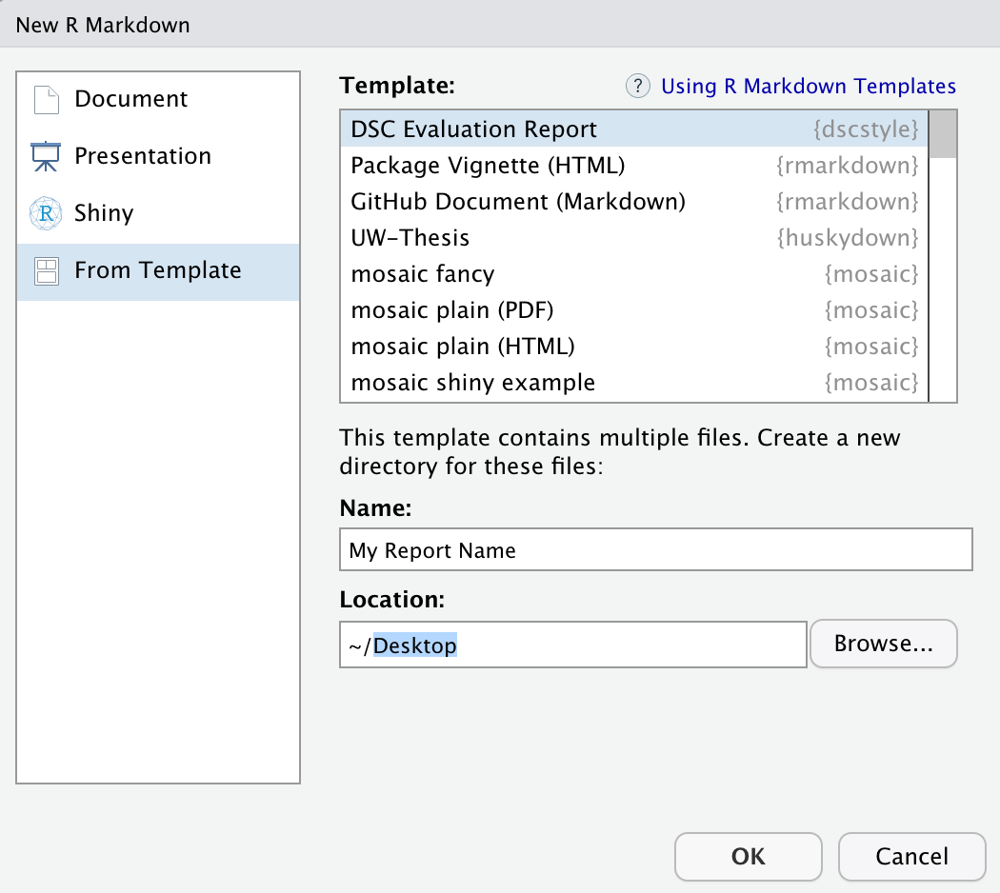

# dscstyle

Report style for the DSV-WAV project


## Installation

Installing from github: `remotes::install_github("zief0002/dscstyle")`

<br /><br />


## DSC Color Palettes

- The package `{dscstyle}` includes three color palettes that are colorblind friendly and look good with the DSC-WAV logo. These palettes are available in the two ggplot2 scale functions: 

  + `scale_color_dsc()`
  + `scale_fill_dsc()` 

These scale functions default to a dark color palette (`palette="dark"`). There is also a lighter palette option (`palette="light"`) that can be included in these functions, as well as a palette for ordered data (`palette="blues"`).

<br />

**Dark Palette**


<br />

**Light Palette**


**Blues Palette**


<br /><br />

## DSC ggplot2 Theme

There is also a ggplot2 theme included in the `{dscstyle}` package:

  + `theme_dsc()`

This uses the Google font Oswald in to format text. To use this requires the `{showtext}` package. While using `theme_dsc()` will render correctly when knitting to an HTML document, unfortunately, it will not render in the RStudio viewer.

Additionally, you will need to set the chunk option for your plot to include `fig.showtext=TRUE`.

<br />

**Example Syntax**

````
```{r fig.showtext=TRUE}
ggplot(data=iris, aes(x = Sepal.Length, fill = Species)) + 
  geom_histogram() + 
  theme_dsc() + 
  scale_fill_dsc()
```
````

<br /><br />

## Rmarkdown DSC Evaluation Report Template

The `{dscstyle}` package also includes a report template to style HTML rendered evaluation reports.

- In RStudio, navigate to `File > New File > R Markdown...`
- Select `From Template`
- Select the **DSC Evaluation Report** from the template options
- Give the RMD file a name
- Click `OK`




You may need to install the `{showtext}` package prior to the first time you use this template. This allows the Oswald Google font to be used in the plots.

This template sets many global knitr options including `fig.showtext=TRUE`, so that they do not have to be included in each chunk.

<br />


